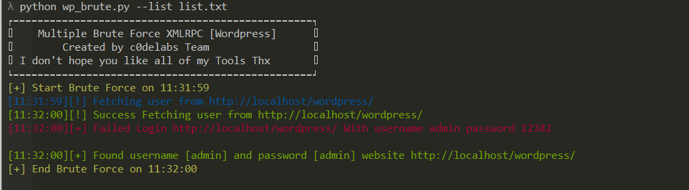

## Multiple Brute Force XMLRPC [Wordpress] 
<a href="http://c0delabs.com/"></a>


### Install

```shell
$ cd wp-brute-xmlrpc
$ pip install -r requirements.txt
```

### Usage (Python 3)

```shell
$ python wp_brute.py -h (show this help message and exit)
$ python wp_brute.py --list list.txt (list.txt -> list url/website victim)
```
## Feature

- Brute Force xmlrpc.php 
- Auto get username from victim
## License

[](http://badges.mit-license.org)

- **[MIT license](http://opensource.org/licenses/mit-license.php)**
